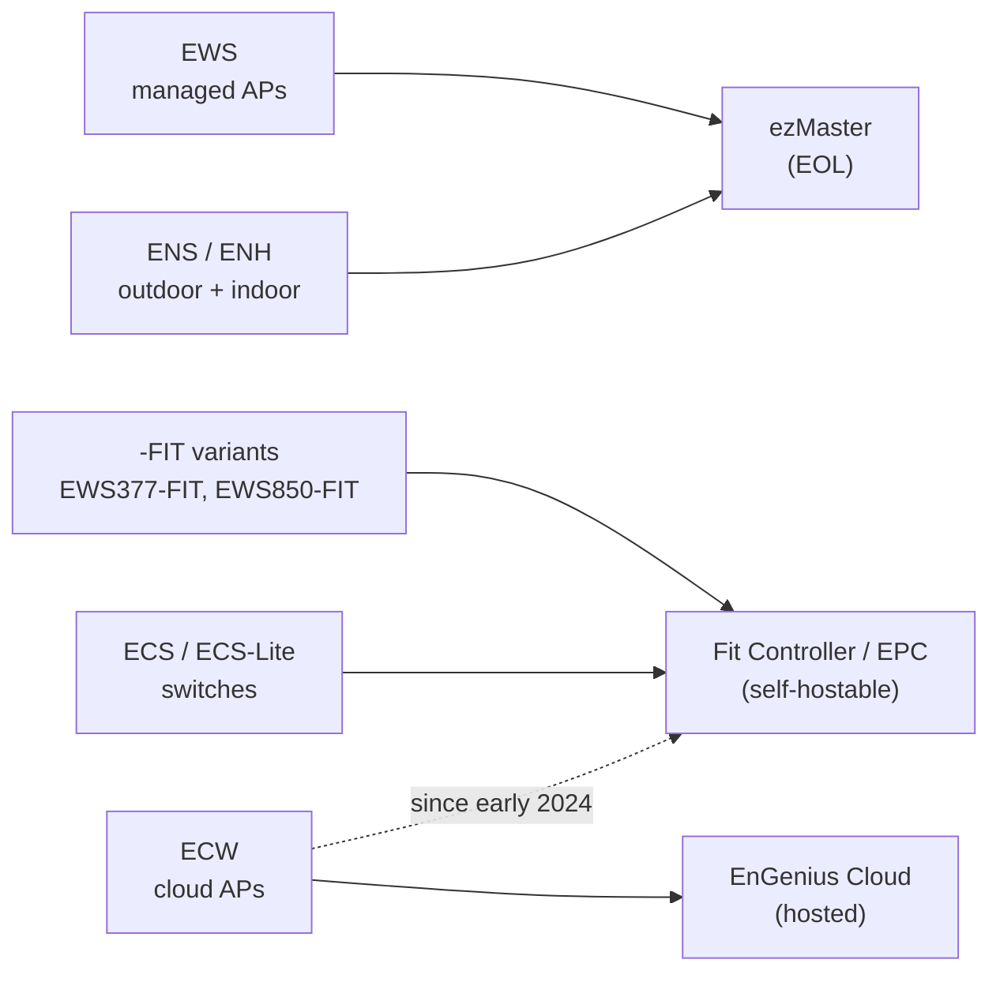
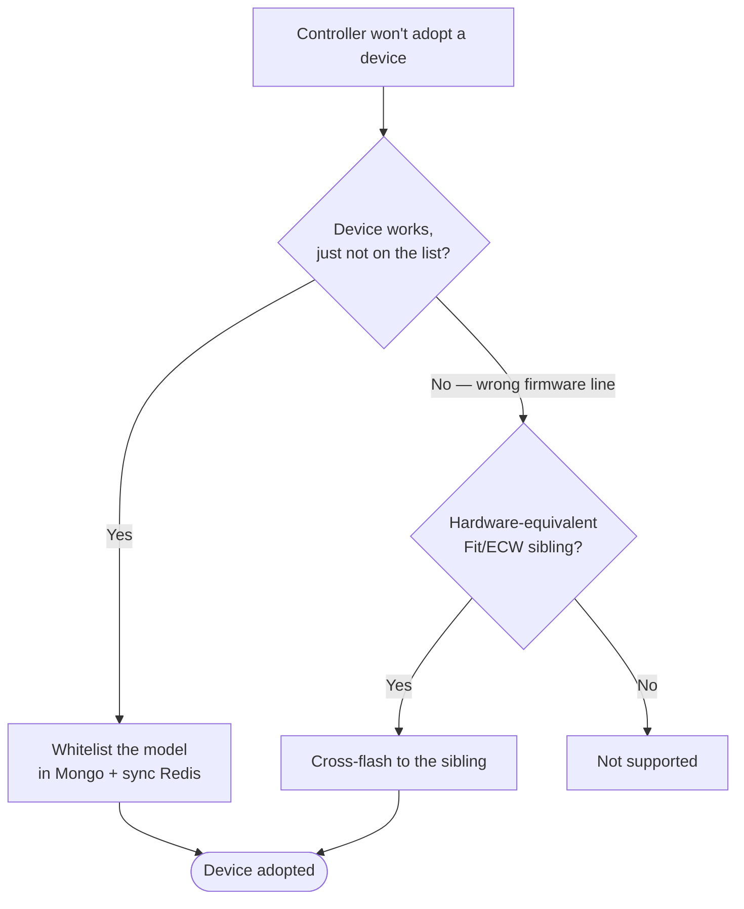

# EnGenius Field Guide

Unofficial field notes for EnGenius/Senao WiFi hardware and the self-hosted
controllers that manage it — running the local Fit Controller / EnGenius Private
Cloud (EPC), reaching the device backend, decoding serials, and cross-flashing
hardware-equivalent models.

## How it fits together

## Start here

| Goal | Go to |
|------|-------|
| Self-host a controller | [landscape](docs/controllers/landscape.md) → [EPC on Podman/AlmaLinux (x86)](docs/controllers/epc-podman-almalinux.md) or [Fit Controller on ARM](docs/controllers/self-hosting-fitcon-arm.md) |
| Adopt a device the controller rejects | [whitelist the model](docs/controllers/add-unknown-models.md) or [cross-flash it](docs/firmware/cross-flashing.md) |
| Decode/generate a serial | [serial-numbers](docs/firmware/serial-numbers.md) |
| Understand product lines / shared hardware | [overview](docs/overview.md), [model-equivalence](docs/hardware/model-equivalence.md) |

### Adopting a device the controller won't take

## Contents

| Doc | Covers |
|-----|--------|
| [overview](docs/overview.md) | Product lines and which controller manages what |
| [controllers/landscape](docs/controllers/landscape.md) | ezMaster vs Fit Controller/EPC; device compatibility |
| [controllers/epc-podman-almalinux](docs/controllers/epc-podman-almalinux.md) | EPC 1.8.8 as Podman containers on AlmaLinux |
| [controllers/self-hosting-fitcon-arm](docs/controllers/self-hosting-fitcon-arm.md) | Fit Controller stack on ARM / Raspberry Pi |
| [controllers/backend-access](docs/controllers/backend-access.md) | MongoDB + Redis access |
| [controllers/add-unknown-models](docs/controllers/add-unknown-models.md) | Whitelist an unsupported model |
| [controllers/custom-https-cert](docs/controllers/custom-https-cert.md) | Replace the controller's TLS cert |
| [firmware/serial-numbers](docs/firmware/serial-numbers.md) | Serial format + Code27 check char |
| [firmware/model-codes](docs/firmware/model-codes.md) | Known 3-char model codes |
| [firmware/firmware-format](docs/firmware/firmware-format.md) | Senao image header, mksenaofw, validation |
| [firmware/cross-flashing](docs/firmware/cross-flashing.md) | Flashing foreign firmware: method + risks |
| [hardware/model-equivalence](docs/hardware/model-equivalence.md) | Which models share hardware |
| [examples/epc-podman/](examples/epc-podman/) | Podman compose + env template |

## Scope

Unofficial community notes for education and interoperability, not endorsed by or
affiliated with the vendor. "EnGenius" and "Senao" are trademarks of their
owners. Expect gaps; verify before relying on anything.

## Contributing

Corrections and additions welcome — especially verified [model codes](docs/firmware/model-codes.md)
and hardware-equivalence pairs. Open an issue or PR.

## License

[Blue Oak Model License 1.0.0](LICENSE). Underlying knowledge credited in
[CREDITS.md](CREDITS.md).
