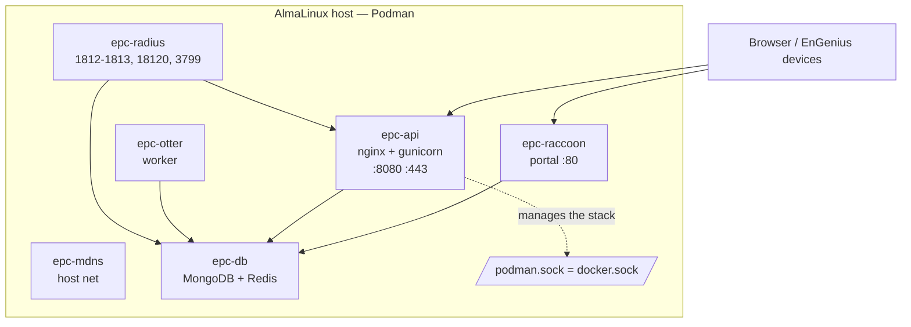

# Running EnGenius Private Cloud (EPC) on Podman / AlmaLinux

Field notes for deploying **EnGenius Private Cloud (EPC) 1.8.8** as **Podman**
containers on **AlmaLinux 10**, instead of the vendor's Docker-on-Ubuntu path.
EnGenius officially supports Docker on Ubuntu/Debian; Podman on AlmaLinux is a
**workable but unsupported** adaptation.

> Context: EPC is EnGenius's modern on-prem controller and a natural
> replacement for the EOL **ezMaster** appliance. These notes come from an
> actual Podman/AlmaLinux deployment that runs green under SELinux Enforcing.

## 1. What EPC actually is

EPC 1.8.8 (`epc.sh` installer, released 2026-02-09) is a **7-container Docker
Compose stack**. Images live on **AWS public ECR** (no auth):
`public.ecr.aws/d3g4m7o9/<name>:1.8.8`.

| Container | Size (amd64) | Role | Host ports |
|-----------|-------------|------|-----------|
| `epc-db` | 127 MB | MongoDB + Redis (data/auth store) | — |
| `epc-api` | 289 MB | Backend (nginx + gunicorn), web UI | 8080→80, 443 |
| `epc-raccoon` | 206 MB | Portal / reverse-proxy front | 80 |
| `epc-mdns` | 82 MB | mDNS/bonjour discovery (**host net**) | (host) |
| `epc-agent` | 76 MB | Device onboarding agent (`agent.yml`) | — |
| `epc-otter` | 58 MB | Background worker | — |
| `epc-radius` | 23 MB | FreeRADIUS (802.1X / CoA) | 1812-1813/udp, 18120, 3799/udp |



Images are **amd64 only** — EPC does not support ARM.

Hardcoded host paths (from the shipped `docker-compose.yml`):
`/epc` (shared config, mounted into 5 containers), `/srv/docker/mongodb/data/db`,
`/srv/docker/redis`, `/var/log/epc/*`, `/root/cert`.

### The one hard part: the Docker socket

`epc-api` bind-mounts `/var/run/docker.sock`. EPC's API **orchestrates its own
containers** (restart, `exec`, DB upgrades) through the container API. On Podman
this becomes the **Podman socket** (`/run/podman/podman.sock`), which speaks the
Docker API. That mapping — plus letting SELinux allow it — is the crux of the
port. The vendor `epc.sh` also runs a host-side **`fitdog` watchdog** and a set
of **named pipes** under `/epc/pipe` that a raw `podman-compose up` does not
recreate (see Caveats).

## 2. Official sizing

| Tier | CPU | RAM | Disk |
|------|-----|-----|------|
| Minimum | 1 core | 2 GB | 20 GB |
| Small (<100 devices) | 2 vCPU | 4 GB | 30 GB |
| Max (3,000 devices) | 8 cores | 32 GB | 30 GB |

Docker-based, x86-64 only, Ubuntu 20.04 / Debian 10 officially recommended.

## 3. Example VM (Proxmox)

A Proxmox VM running AlmaLinux 10, sized a step above the "small" tier:

- **8 vCPU**, `cpu: host` (full CPU features for the Docker/DB workload)
- **16 GB RAM ceiling / 8 GB balloon floor** — ballooning on. A 50% floor
  (rather than the usual ~25%) because Mongo/DB workloads suffer under
  aggressive balloon reclaim.
- **64 GB thin disk** on an NVMe pool, `ssd=1,discard=on` for TRIM.
- QEMU guest agent on, `ostype: l26`, virtio-scsi-single, virtio NIC.

## 4. Machine prep

```bash
# prerequisites
sudo dnf -y update                                   # + reboot for new kernel
sudo dnf -y install epel-release
sudo dnf -y install podman podman-compose curl wget tar jq

# podman socket = docker.sock replacement
sudo systemctl enable --now podman.socket            # -> /run/podman/podman.sock

# host directories EPC expects
sudo mkdir -p /epc /root/cert \
  /srv/docker/mongodb/data/db /srv/docker/redis \
  /var/log/epc/{mongodb,redis,nginx,gunicorn,api,raccoon,otter}

# firewall
for p in 80/tcp 443/tcp 8080/tcp 18120/tcp 1812/udp 1813/udp 3799/udp; do
  sudo firewall-cmd --permanent --add-port=$p
done; sudo firewall-cmd --reload

# pre-stage all 7 images
for i in agent api db raccoon otter mdns radius; do
  sudo podman pull public.ecr.aws/d3g4m7o9/epc-$i:1.8.8
done
```

Reference versions used: podman 5.8.2, podman-compose 1.5.0, kernel 6.12
(el10_2), SELinux **Enforcing**.

## 5. Deploy — the procedure that actually worked (tested)

The faithful path is to let the vendor `epc.sh` orchestrate (it does the DB
init, UUID, replica-set arbiter, watchdog) but back it with Podman via shims.
`examples/epc-podman/docker-compose.yml` in this repo is a hand-translated alternative,
but the **tested** deploy used the vendor compose + shims below.

```bash
# --- shims so epc.sh's docker/docker-compose calls hit Podman ---
sudo dnf -y install podman-docker            # `docker` -> podman
sudo touch /etc/containers/nodocker          # silence emulation banner
sudo ln -sf /usr/bin/podman-compose /usr/local/bin/docker-compose
sudo systemctl enable --now podman.socket
sudo ln -sf /run/podman/podman.sock /var/run/docker.sock   # docker.sock mount
sudo setenforce 0                            # SELinux permissive (see caveats)

# --- patch the installer: skip apt/Docker install, drop -it (no TTY over ssh) ---
sed -i 's/^ENVIRONMENT=0/ENVIRONMENT=1/' epc.sh   # skips install_tools + pull
sed -i 's/docker exec -it/docker exec/g' epc.sh

# --- run it ---  (backgrounds a fitdog watchdog that holds the tty; redirect it)
sudo ./epc.sh install 1.8.8   > /tmp/epc.log 2>&1 &

# If epc.sh stalls, bring the stack up by hand (equivalent to its start()):
cd /epc/pipe
sudo podman-compose -p epc -f docker-compose.yml --env-file .epc-prod up -d

# --- REQUIRED fix: epc.sh's setup_env doesn't write config.ini's [ocu] ---
printf "[ocu]\nstage = production\nversion = 1.8.8\n" | sudo tee /epc/config.ini

# --- finish init (create_uuid + import default DB data) ---
sudo docker exec epc-api sh -c 'python /app/create_uuid.pyc'
sudo docker exec epc-api sh -c 'python /app/db-init.pyc -t'   # -> 1 when DB ready
sudo docker exec epc-api sh -c 'python /app/db-init.pyc -i'   # import default data

# --- persistence ---
sudo systemctl enable podman-restart.service            # restart=always on boot
```

**Result (verified):** all 6 containers (`epc-db/api/mdns/raccoon/otter/radius`)
Up; `https://<vm-ip>/` and `http://<vm-ip>:8080/` return 200 and render the EPC
**v1.8.8** first-run sign-up page ("EnGenius Private Cloud – On-Premises Network
Management"). API↔Mongo↔Redis healthy per `epc-api` logs. First real step is
creating the admin account through that sign-up page.

## 6. Gotchas found during the port

1. **`config.ini` `[ocu]` section is missing.** `epc.sh`'s `setup_env` fails to
   write `/epc/config.ini`, so `create_uuid.pyc` dies with
   `configparser.NoSectionError: No section: 'ocu'`. Write it by hand (above).
2. **`fitdog` watchdog holds the TTY.** `pipe_init` backgrounds
   `/epc/pipe/fitdog`; over SSH it keeps the channel open and looks like a hang.
   Redirect the installer's output to a file and/or background it.
3. **`.agent` env is not created**, so the `epc-agent` (device-onboarding)
   compose is skipped. The controller UI works without it, but **devices cannot
   onboard until it (plus the pipes + `fitdog`) are running** — see §8.
4. **SELinux — hardened to Enforcing.** The vendor compose won't run Enforcing
   (no volume labels, socket mounted without `label=disable`). The fix, verified
   working with **0 AVC denials across a reboot**:
   ```bash
   # persistent host labels (survives restorecon, unlike :Z categories)
   for d in /epc /srv/docker /var/log/epc /root/cert; do
     sudo semanage fcontext -a -t container_file_t "${d}(/.*)?"; done
   sudo restorecon -RF /epc /srv/docker /var/log/epc /root/cert
   # redeploy on the hardened compose in this repo (epc-api gets label=disable
   # for the podman socket; all mounts use shared :z)
   sudo podman-compose -p epc -f examples/epc-podman/docker-compose.yml \
        --env-file /epc/pipe/.epc-prod up -d
   sudo sed -i 's/^SELINUX=permissive/SELINUX=enforcing/' /etc/selinux/config
   sudo setenforce 1
   ```
   Only `epc-api` gets `label=disable` (it must reach the podman socket);
   everything else stays fully SELinux-confined.
5. **Docker-API compatibility.** `epc-api` drives `/var/run/docker.sock` (now the
   podman socket) with the Docker SDK/CLI. Startup + init worked; verify the
   built-in **in-app updater** (it `docker exec`s + pulls `epc-pkg.tar.gz`)
   before relying on it.
6. **Backups:** stop the stack (or `mongodump` inside `epc-db`) before copying
   `/srv/docker/mongodb/data/db`. Never copy live DB files.

## 7. Source of truth

- Installer: `http://engenius-epc.s3.us-west-2.amazonaws.com/dev/1.8.8/epc.sh`
- Package (compose + configs): `.../1.8.8/epc-pkg.tar.gz`
- Docs: https://doc.engenius.ai/home-epc-quick-start-guide

## 8. Device onboarding — the agent, the pipes, and the mTLS gate

This is the part a bare `podman-compose up` silently drops, and without it
`db.devices.count()` stays **0** no matter what the AP does. Evidence and fix:

### 8a. What the missing pieces are

The vendor `epc.sh` runs a *second* compose project (`agent.yml`) plus a
host-side pipe servicer that the main compose doesn't:

- **`epc-agent`** — host-network container, mounts `/epc` + the Docker socket.
  Handles software/OCU updates, `/etc/hosts` replica-set names, and host-command
  requests from the other containers.
- **`fitdog` → `host.sh`** — a host loop that reads `req_id;;cmd` from
  `/epc/pipe/host` and `eval`s it on the host (container→host command bridge),
  replying on `resp_<id>`. `host.sh` ships inside the `epc-pkg.tar.gz` and the
  `epc-agent` image (`/app/host.sh`).

### 8b. Bring them up (Podman)

```bash
# named pipes + host servicer
sudo systemctl start podman.socket
for p in req msg host host_msg; do [ -p /epc/pipe/$p ] || sudo mkfifo /epc/pipe/$p; done
sudo cp <epc-pkg>/host.sh /epc/pipe/host.sh; sudo chmod +x /epc/pipe/host.sh /epc/pipe/fitdog
sudo sh -c 'nohup /epc/pipe/fitdog >/var/log/epc/fitdog.log 2>&1 &'   # -> host.sh

# the agent (docker.sock -> podman.sock; label=disable for the socket)
sudo mkdir -p /var/log/epc/agent
sudo podman run -d --replace --name epc-agent --network host --restart always \
  -v /epc:/epc:z -v /var/log/epc/agent:/var/log/epc:z \
  -v /run/podman/podman.sock:/var/run/docker.sock:z --security-opt label=disable \
  -e REPOSITORY_URI=public.ecr.aws/d3g4m7o9/ -e VERSION=1.8.8 -e HOST_IP=<vm-ip> \
  public.ecr.aws/d3g4m7o9/epc-agent:1.8.8 /start-agent.sh
```

Healthy agent logs: `epc Agent Starting…` / `EPC is not HA mode.`

### 8c. How a device finds the EPC

The EPC advertises itself by **mDNS**: `epc-mdns` announces
`Minicloud_<id>._http._tcp.local` with a TXT record carrying the onboarding URLs
(`checkin_scheme=https checkin_port=443 checkin_path=/api/v1/checkin`,
`raccoon_port=80 raccoon_register_path=/device/register`, `project=epc`). A
cloud/FIT AP on the same L2 hears it and check-ins. Cross-subnet, hand it the
controller with **DHCP option 43 = the EPC IP** (raw 4-byte address) — EnGenius's
`udhcpc` exposes it as `acaddr` and writes it to `/tmp/dhcp_option`
(`force_ac` > `dhcp_ac` > mDNS is the AP's resolution order).

### 8d. The auth gate (why check-ins can 404 forever)

Device auth is **mutual-TLS**: the AP presents a client certificate from its
per-device `cert` MTD partition, and `epc-api` derives the device `id` from it.
If the cert-identity isn't an accepted/registered device, the check-in loop fails
at auth — the app logs `handle_auth_request … checkin key error: 'id'` and
returns 4xx, and the device never enrolls. Watch it live:

```bash
sudo podman exec epc-api sh -c 'tail -f /var/log/nginx/*.log' | grep checkin
sudo podman logs -f epc-api | grep -iE 'checkin|register|id'
```

So a working onboarding needs three things true at once: **agent + pipes up**
(§8b), the **device reachable to the EPC's mDNS/opt-43** (§8c), and a **device
identity the controller accepts** (§8d). The last one is why a *cross-flashed* AP
(whose cert/serial still read as its original model) can reach the EPC and still
be refused — see the cross-flash guide.
