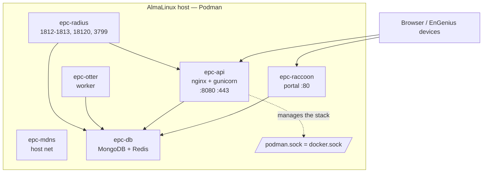

# Running EnGenius Private Cloud (EPC) on Podman / AlmaLinux

> **Status: deprecated — use [Docker/Ubuntu](epc-docker-ubuntu.md) instead.**
> This guide documents a working Podman port that ran in production for four
> months (June–September 2026). We moved off it after two production incidents
> caused by the shim stack. The code is preserved here for reference, SELinux
> research, and anyone running RHEL-family hosts where Docker isn't an option.
> See the [Docker guide's post-mortem](epc-docker-ubuntu.md#5-why-we-moved-off-podman--a-post-mortem)
> for what broke and why.

Field notes for deploying **EnGenius Private Cloud (EPC) 1.8.8–1.9.1** as
**Podman** containers on **AlmaLinux 10**, instead of the vendor's
Docker-on-Ubuntu path. EnGenius officially supports Docker on Ubuntu/Debian;
Podman on AlmaLinux is a **workable but unsupported** adaptation.

> Context: EPC is EnGenius's modern on-prem controller and a natural
> replacement for the EOL **ezMaster** appliance. These notes come from an
> actual Podman/AlmaLinux deployment — tested on 1.8.8 and 1.9.1 — that runs
> green under SELinux Enforcing with a cross-flashed AP adopted and checking in.

## 1. What EPC actually is

EPC is a **7-container Docker Compose stack**. Images live on **AWS public ECR**
(no auth): `public.ecr.aws/d3g4m7o9/<name>:<version>`.

Available versions (checked via S3):

```
http://engenius-epc.s3.us-west-2.amazonaws.com/dev/<version>/epc-pkg.tar.gz
```

| Version | Status |
|---------|--------|
| 1.8.8 | ✅ tested on Podman |
| 1.8.9 | available (untested) |
| 1.9.0 | available (untested) |
| 1.9.1 | ✅ tested on Podman, AP adopted |

Other versions return 403 (not published). Use a working version as baseline
and check S3 before assuming a newer one exists.

| Container | Role | Host ports | Notes |
|-----------|------|-----------|-------|
| `epc-db` | MongoDB + Redis (data/auth store) | — | |
| `epc-api` | Backend (nginx + gunicorn), web UI | 8080→80, 443 | |
| `epc-raccoon` | Portal / reverse-proxy front | 80 | |
| `epc-mdns` | mDNS/bonjour discovery (**host net**) | — | |
| `epc-agent` | Device onboarding agent | — | In main compose ≥1.9.1; separate `agent.yml` on 1.8.8 |
| `epc-otter` | Background worker | — | |
| `epc-radius` | FreeRADIUS (802.1X / CoA) | 1812-1813/udp, 18120, 3799/udp | |


```mermaid
flowchart TB
    USER["Browser / EnGenius devices"]
    subgraph host["AlmaLinux host — Podman"]
        RAC["epc-raccoon<br/>portal :80"]
        API["epc-api<br/>nginx + gunicorn<br/>:8080 :443"]
        RAD["epc-radius<br/>1812-1813, 18120, 3799"]
        OT["epc-otter<br/>worker"]
        MD["epc-mdns<br/>host net"]
        DB["epc-db<br/>MongoDB + Redis"]
        SOCK[/"podman.sock = docker.sock"/]
    end
    USER --> RAC
    USER --> API
    RAC --> DB
    API --> DB
    OT --> DB
    RAD --> API
    RAD --> DB
    API -. "manages the stack" .-> SOCK
```

Images are **amd64 only** — EPC does not support ARM.

Hardcoded host paths (from the shipped `docker-compose.yml`):
`/epc` (shared config, mounted into 5 containers), `/srv/docker/mongodb/data/db`,
`/srv/docker/redis`, `/var/log/epc/*`, `/root/cert`.

### The one hard part: the Docker socket

`epc-api` bind-mounts `/var/run/docker.sock`. EPC's API **orchestrates its own
containers** (restart, `exec`, DB upgrades) through the container API. On Podman
this becomes the **Podman socket** (`/run/podman/podman.sock`), which speaks the
Docker API. That mapping — plus letting SELinux allow it — is the crux of the
port. The vendor `epc.sh` also runs a host-side **`fitdog` watchdog** and a set
of **named pipes** under `/epc/pipe` that a raw `podman-compose up` does not
recreate (see Caveats).

## 2. Official sizing

| Tier | CPU | RAM | Disk |
|------|-----|-----|------|
| Minimum | 1 core | 2 GB | 20 GB |
| Small (<100 devices) | 2 vCPU | 4 GB | 30 GB |
| Max (3,000 devices) | 8 cores | 32 GB | 30 GB |

Docker-based, x86-64 only, Ubuntu 20.04 / Debian 10 officially recommended.

## 3. Example VM (Proxmox)

A Proxmox VM running AlmaLinux 10, sized a step above the "small" tier:

- **8 vCPU**, `cpu: host` (full CPU features for the Docker/DB workload)
- **16 GB RAM ceiling / 8 GB balloon floor** — ballooning on. A 50% floor
  (rather than the usual ~25%) because Mongo/DB workloads suffer under
  aggressive balloon reclaim.
- **64 GB thin disk** on an NVMe pool, `ssd=1,discard=on` for TRIM.
- QEMU guest agent on, `ostype: l26`, virtio-scsi-single, virtio NIC.

## 4. Machine prep

```bash
# prerequisites
sudo dnf -y update                                   # + reboot for new kernel
sudo dnf -y install epel-release
sudo dnf -y install podman podman-compose curl wget tar jq

# podman socket = docker.sock replacement
sudo systemctl enable --now podman.socket            # -> /run/podman/podman.sock

# host directories EPC expects
sudo mkdir -p /epc /root/cert \
  /srv/docker/mongodb/data/db /srv/docker/redis \
  /var/log/epc/{mongodb,redis,nginx,gunicorn,api,raccoon,otter}

# firewall
for p in 80/tcp 443/tcp 8080/tcp 18120/tcp 1812/udp 1813/udp 3799/udp; do
  sudo firewall-cmd --permanent --add-port=$p
done; sudo firewall-cmd --reload

# pre-stage all 7 images (substitute your target version)
EPC_VER=1.9.1
for i in agent api db raccoon otter mdns radius; do
  sudo podman pull public.ecr.aws/d3g4m7o9/epc-$i:$EPC_VER
done
```

Reference versions used: podman 5.8.2, podman-compose 1.5.0, kernel 6.12
(el10_2), SELinux **Enforcing**.

## 5. Deploy — the procedure that actually worked (tested)

The faithful path is to let the vendor `epc.sh` orchestrate (it does the DB
init, UUID, replica-set arbiter, watchdog) but back it with Podman via shims.
`examples/epc-podman/docker-compose.yml` in this repo is a hand-translated alternative,
but the **tested** deploy used the vendor compose + shims below.

```bash
# --- shims so epc.sh's docker/docker-compose calls hit Podman ---
sudo dnf -y install podman-docker            # `docker` -> podman
sudo touch /etc/containers/nodocker          # silence emulation banner
sudo ln -sf /usr/bin/podman-compose /usr/local/bin/docker-compose
sudo systemctl enable --now podman.socket
sudo ln -sf /run/podman/podman.sock /var/run/docker.sock   # docker.sock mount
sudo setenforce 0                            # SELinux permissive (see caveats)

# --- patch the installer: skip apt/Docker install, drop -it (no TTY over ssh) ---
sed -i 's/^ENVIRONMENT=0/ENVIRONMENT=1/' epc.sh   # skips install_tools + pull
sed -i 's/docker exec -it/docker exec/g' epc.sh

# --- run it ---  (backgrounds a fitdog watchdog that holds the tty; redirect it)
sudo ./epc.sh install $EPC_VER   > /tmp/epc.log 2>&1 &

# If epc.sh stalls, bring the stack up by hand (equivalent to its start()):
cd /epc/pipe
sudo podman-compose -p epc -f docker-compose.yml --env-file .epc-prod up -d

# --- REQUIRED fix: epc.sh's setup_env doesn't write config.ini's [ocu] ---
printf "[ocu]\nstage = production\nversion = $EPC_VER\n" | sudo tee /epc/config.ini

# --- finish init (create_uuid + import default DB data) ---
sudo docker exec epc-api sh -c 'python /app/create_uuid.pyc'
sudo docker exec epc-api sh -c 'python /app/db-init.pyc -t'   # -> 1 when DB ready
sudo docker exec epc-api sh -c 'python /app/db-init.pyc -i'   # import default data

# --- persistence ---
sudo systemctl enable podman-restart.service            # restart=always on boot
```

**Result (verified on 1.8.8 and 1.9.1):** all 7 containers
(`epc-db/api/mdns/raccoon/otter/agent/radius`) Up; `https://<vm-ip>/` and
`http://<vm-ip>:8080/` return 200 and render the EPC first-run sign-up page.
API↔Mongo↔Redis healthy per `epc-api` logs. First real step is creating the
admin account through that sign-up page.

## 6. Gotchas found during the port

1. **`config.ini` `[ocu]` section is missing.** `epc.sh`'s `setup_env` fails to
   write `/epc/config.ini`, so `create_uuid.pyc` dies with
   `configparser.NoSectionError: No section: 'ocu'`. Write it by hand (above).
2. **`fitdog` watchdog holds the TTY.** `pipe_init` backgrounds
   `/epc/pipe/fitdog`; over SSH it keeps the channel open and looks like a hang.
   Redirect the installer's output to a file and/or background it.
3. **`.agent` env is not created**, so the `epc-agent` (device-onboarding)
   compose is skipped. The controller UI works without it, but **devices cannot
   onboard until it (plus the pipes + `fitdog`) are running** — see §8.
4. **SELinux — hardened to Enforcing.** The vendor compose won't run Enforcing
   (no volume labels, socket mounted without `label=disable`). The fix, verified
   working with **0 AVC denials across a reboot**:
   ```bash
   # persistent host labels (survives restorecon, unlike :Z categories)
   for d in /epc /srv/docker /var/log/epc /root/cert; do
     sudo semanage fcontext -a -t container_file_t "${d}(/.*)?"; done
   sudo restorecon -RF /epc /srv/docker /var/log/epc /root/cert
   # redeploy on the hardened compose in this repo (epc-api gets label=disable
   # for the podman socket; all mounts use shared :z)
   sudo podman-compose -p epc -f examples/epc-podman/docker-compose.yml \
        --env-file /epc/pipe/.epc-prod up -d
   sudo sed -i 's/^SELINUX=permissive/SELINUX=enforcing/' /etc/selinux/config
   sudo setenforce 1
   ```
   Only `epc-api` gets `label=disable` (it must reach the podman socket);
   everything else stays fully SELinux-confined.
5. **Docker-API compatibility.** `epc-api` drives `/var/run/docker.sock` (now the
   podman socket) with the Docker SDK/CLI. Startup + init worked; verify the
   built-in **in-app updater** (it `docker exec`s + pulls `epc-pkg.tar.gz`)
   before relying on it.
6. **Backups:** stop the stack (or `mongodump` inside `epc-db`) before copying
   `/srv/docker/mongodb/data/db`. Never copy live DB files.
7. **Hypervisor `onboot` is not optional.** A Proxmox/libvirt VM with `onboot`
   unset (default **0**) does **not** come back after a *host* reboot — Podman's
   `restart: always` and `podman-restart.service` only apply once the VM itself
   is running; they cannot start a VM that never powered on. Symptom: DNS still
   resolves, but the box is completely dead (ping/ICMP "host is down", every
   port closed) — looks like a network fault, isn't. Confirm and fix on the
   hypervisor, not the guest:
   ```bash
   qm config <vmid> | grep onboot      # Proxmox: unset/0 = will NOT autostart
   qm set <vmid> --onboot 1
   ```
   (libvirt equivalent: `virsh dominfo <vm> | grep Autostart`, then
   `virsh autostart <vm>`.) Set this **immediately after VM creation**, not
   after the first outage teaches you the hard way.
8. **The vendor `docker-compose.yml` is a live landmine — remove it.** The
   installer stages **two** compose files side by side in `/epc/pipe/`: the
   untouched vendor `docker-compose.yml` (what `epc.sh` itself drives — no
   Podman-socket translation, no cert bind-mounts, no SELinux labels) and
   whatever hardened/translated file you actually deploy from (e.g.
   `docker-compose-podman.yml`). If `epc.sh`'s own background install run
   (§5 — it can still be alive, retrying, well after you've moved on) or any
   later `docker exec`-driven self-update reaches its own `up`, it recreates
   the containers **from the vendor file**, silently reverting every Podman
   customization — including a real TLS cert back to EnGenius's baked-in,
   **already-expired (2015-issued vendor cert, CN `www.engeniusnetworks.com`,
   expired 2025-07-10)** self-signed one. This looks exactly like a MITM
   warning in a browser; it's actually a stale-config regression. Fix:
   ```bash
   mv /epc/pipe/docker-compose.yml /epc/pipe/docker-compose.yml.DO-NOT-USE
   ```
   once your hardened file is confirmed working, so nothing can ever exec
   against the vendor version again. Re-verify after: `podman inspect epc-api`
   should show your cert/socket mounts, not the vendor defaults.

9. **Mongo index conflict on version upgrade.** Upgrading from 1.8.8 to 1.9.1
   (reusing the same Mongo data) can fail with `IndexOptionsConflict: Index with
   name: profile.email_1 already exists with different options`. The 1.9.1
   schema changed the index definition. Fix: drop the conflicting index in Mongo,
   then restart `epc-api`:
   ```bash
   sudo podman exec epc-db mongosh --eval \
     "db.getSiblingDB('main').users.dropIndex('profile.email_1')"
   sudo podman restart epc-api
   ```

## 6b. Real TLS cert (replace the expired vendor one)

`epc-api`'s nginx serves TLS from **paths baked into the image**:
`/app/nginx.crt` + `/app/nginx.key` — not `/epc/portal_cert/` (a different,
unrelated cert pair that ships alongside but isn't what's on the wire; don't
waste time replacing that one). Confirm what's actually being served and what
nginx expects:
```bash
echo | openssl s_client -connect <vm-ip>:443 2>/dev/null | openssl x509 -noout -subject -enddate
sudo podman exec epc-api grep -n ssl_certificate /nginx.conf   # -> /app/nginx.crt, /app/nginx.key
```
Get a real cert (Let's Encrypt via DNS-01 works even if the hostname only
resolves internally — DNS-01 only needs the zone's public NS to accept the
ACME TXT record, not a reachable A record) and bind-mount it over the vendor
paths instead of trying to inject it into the image:
```bash
curl -s https://get.acme.sh | sudo sh
sudo env CF_Token="<cloudflare-api-token>" \
  /root/.acme.sh/acme.sh --issue --dns dns_cf -d <host>.<domain>
sudo /root/.acme.sh/acme.sh --install-cert -d <host>.<domain> --ecc \
  --fullchain-file /root/cert/<host>.crt --key-file /root/cert/<host>.key \
  --reloadcmd "podman restart epc-api"        # auto-renew + auto-reinstall
```
Add two lines to `epc-api`'s `volumes:` in your hardened compose (**not** the
vendor file — see gotcha 8):
```yaml
- /root/cert/<host>.crt:/app/nginx.crt:ro
- /root/cert/<host>.key:/app/nginx.key:ro
```
Then a **full stack cycle**, not a single-container recreate — Podman's
inter-container `depends_on`/`--requires` chain (`epc-radius` requires
`epc-api` requires `epc-db`) blocks removing/recreating one container while
another depends on it:
```bash
cd /epc/pipe
sudo podman-compose -p epc -f docker-compose-podman.yml --env-file .epc-prod down
sudo podman-compose -p epc -f docker-compose-podman.yml --env-file .epc-prod up -d
```
Data survives — Mongo and `/epc` live on host bind mounts, not in the
container. Verify with a **clean** `curl` (no `-k`): `verify=0` and a matching
CN means it worked.

## 7. Source of truth

- Installer: `http://engenius-epc.s3.us-west-2.amazonaws.com/dev/<version>/epc.sh`
- Package (compose + configs): `.../dev/<version>/epc-pkg.tar.gz`
- Docs: https://doc.engenius.ai/home-epc-quick-start-guide

Substitute `<version>` with `1.8.8`, `1.8.9`, `1.9.0`, or `1.9.1` (known
available). Other version strings return 403.

## 8. Device onboarding — the agent, the pipes, and the mTLS gate

This is the part a bare `podman-compose up` silently drops, and without it
`db.devices.count()` stays **0** no matter what the AP does. Evidence and fix:

### 8a. What the missing pieces are

The vendor `epc.sh` runs a *second* compose project (`agent.yml`) plus a
host-side pipe servicer that the main compose doesn't:

- **`epc-agent`** — host-network container, mounts `/epc` + the Docker socket.
  Handles software/OCU updates, `/etc/hosts` replica-set names, and host-command
  requests from the other containers. **On EPC ≥1.9.1** the agent is included in
  the main compose; on 1.8.8 it runs as a separate project.
- **`fitdog` → `host.sh`** — a host loop that reads `req_id;;cmd` from
  `/epc/pipe/host` and `eval`s it on the host (container→host command bridge),
  replying on `resp_<id>`. `host.sh` ships inside the `epc-pkg.tar.gz` and the
  `epc-agent` image (`/app/host.sh`).

### 8b. Bring them up (Podman)

**EPC ≥1.9.1:** `epc-agent` is in the main compose — a plain `podman-compose up
-d` starts all 7 containers. You still need the named pipes + fitdog:

```bash
sudo systemctl start podman.socket
for p in req msg host host_msg; do [ -p /epc/pipe/$p ] || sudo mkfifo /epc/pipe/$p; done
sudo cp <epc-pkg>/host.sh /epc/pipe/host.sh; sudo chmod +x /epc/pipe/host.sh /epc/pipe/fitdog
sudo sh -c 'nohup /epc/pipe/fitdog >/var/log/epc/fitdog.log 2>&1 &'   # -> host.sh
```

**EPC 1.8.8:** the agent is **not** in the main compose — run it manually:

```bash
# named pipes + host servicer (same as above)

# the agent (docker.sock -> podman.sock; label=disable for the socket)
sudo mkdir -p /var/log/epc/agent
sudo podman run -d --replace --name epc-agent --network host --restart always \
  -v /epc:/epc:z -v /var/log/epc/agent:/var/log/epc:z \
  -v /run/podman/podman.sock:/var/run/docker.sock:z --security-opt label=disable \
  -e REPOSITORY_URI=public.ecr.aws/d3g4m7o9/ -e VERSION=$EPC_VER -e HOST_IP=<vm-ip> \
  public.ecr.aws/d3g4m7o9/epc-agent:$EPC_VER /start-agent.sh
```

Healthy agent logs: `epc Agent Starting…` / `EPC is not HA mode.`

### 8c. How a device finds the EPC

The EPC advertises itself by **mDNS**: `epc-mdns` announces
`Minicloud_<id>._http._tcp.local` with a TXT record carrying the onboarding URLs
(`checkin_scheme=https checkin_port=443 checkin_path=/api/v1/checkin`,
`raccoon_port=80 raccoon_register_path=/device/register`, `project=epc`). A
cloud/FIT AP on the same L2 hears it and check-ins. Cross-subnet, hand it the
controller with **DHCP option 43 = the EPC IP** (raw 4-byte address) — EnGenius's
`udhcpc` exposes it as `acaddr` and writes it to `/tmp/dhcp_option`
(`force_ac` > `dhcp_ac` > mDNS is the AP's resolution order).

### 8d. The auth gate (why check-ins can 404 forever)

The device identifies itself in a header, not a client cert (the EPC does **not**
send a `CertificateRequest` on `/api/v1/checkin`):

```
Kaiwoo-authentication: id=<mac>,timestamp=…,nonce=…,sn=<serial>
```

`epc-api` keys the device by **serial**: a Redis Lua `HMGET device/<sn> secret` —
no record ⇒ `DEVICE_NOT_FOUND`, surfaced as `handle_auth_request … checkin key
error: 'id'` and a 4xx loop. Watch it live:

```bash
sudo podman exec epc-api sh -c 'tail -f /var/log/nginx/*.log' | grep checkin
sudo podman logs -f epc-api | grep -iE 'checkin|register|id'
# and the redis side:
sudo podman exec epc-db redis-cli --scan --pattern 'device/*'
```

So onboarding needs three things true at once: **agent + pipes up** (§8b), the
**device reachable to the EPC's mDNS/opt-43** (§8c), and a **serial the controller
knows** (§8d). The last is where a *cross-flashed* AP dies: it can present a
**blank serial** (`sn=0000…`) if the foreign firmware can't read the board's
factory serial, so it never matches a `device/<sn>` record — see the
[cross-flash walkthrough](crossflash-ews377apv3-walkthrough.md) for reading and
re-writing the serial (`setconfig -g/-s 19`).

### 8e. Podman-specific patches for device adoption

Two fixes are required on Podman that Docker doesn't need. Both are
bind-mounted in the compose file and survive container rebuilds.

**1. nginx resolver: `127.0.0.11` → `10.89.0.1`**

nginx inside `epc-api` uses `set $raccoon epc-raccoon;` for dynamic upstream
resolution. The image ships `resolver 127.0.0.11` — Docker's embedded DNS.
Podman's container DNS lives at **`10.89.0.1`**. Without this fix, every
`GET /device/register` → **502** (30 s timeout per attempt, indefinitely).

```bash
# extract the config from the running image, patch the resolver
sudo podman cp epc-api:/nginx.conf /epc/nginx.conf.podman
sed -i 's/resolver 127\.0\.0\.11/resolver 10.89.0.1/' /epc/nginx.conf.podman
```

Add to `epc-api` volumes in compose:
```yaml
- /epc/nginx.conf.podman:/nginx.conf:ro
```

Restart the stack. Verify: `curl -sk https://localhost/device/register` should
no longer 502 (a 404 "not registered" is the correct not-yet-adopted response).

**2. checkin.pyc signature bypass (firmware HMAC mismatch)**

AP firmware ≥1.8.114 computes the `Kaiwoo-signature` HMAC-SHA256 differently
from what EPC 1.8.8–1.9.1's `valid_signature_ex` expects. The
`DEFAULT_PRESHARED_KEY` (`{mac}{snextra}@ne$`) is correct, but the message
format changed between firmware generations. Exhaustive brute-force of all
message×key combinations confirmed no match — this is a protocol-level
incompatibility, not a config issue.

The fix is a **bytecode patch** in `routers/checkin.pyc`, function
`handle_auth_request`. The `EXTENDED_ARG + POP_JUMP_IF_FALSE` that gates the
`valid_signature_ex` result is replaced with `POP_TOP + NOP`, unconditionally
passing. The exact offset differs per EPC version (check the bytecode — look
for the `CALL_METHOD` to `valid_signature_ex` and the conditional jump that
follows it).

```bash
# back up the original
sudo podman cp epc-api:/app/routers/checkin.pyc /epc/checkin.pyc.orig
cp /epc/checkin.pyc.orig /epc/checkin.pyc.patched
# apply the patch (use a hex editor or python to patch the two bytes)
```

Add to `epc-api` volumes:
```yaml
- /epc/checkin.pyc.patched:/app/routers/checkin.pyc:ro
```

> ⚠️ This bypasses signature validation for **all** devices, not just one.
> Acceptable on an isolated lab/home network; on a shared network, consider
> the implications. Revert by removing the bind-mount.

### 8f. Redis device hash is flushed on every epc-api restart

`epc-api` flushes **all** Redis keys on startup, then re-creates org/network/model
data from MongoDB — but does **not** re-create `device/<mac>` hashes. After any
`epc-api` container restart or stack cycle, the AP's check-in will 404 until
you re-seed the device hash from a Python one-liner inside `epc-api`:

```bash
sudo podman exec epc-api python3 -c "
import redis, os
r = redis.Redis(host='epc-db', port=6379,
    password=os.environ.get('REDIS_PASS',''), decode_responses=True)
r.hset('device/<mac_lower>', mapping={
  'secret': 'bootstrap', 'falcon_nid': '<network_id>',
  'name': '<device_name>', 'type': 'ap', 'model': '<model>',
  'is_sync_config': '0', 'config_version': '0', 'is_in_trial_zone': '0',
  'expired_date': '4102444800', 'license_type': 'pro',
  'last_checkin_time': '0', 'first_checkin_time': '0',
  'upgrade_deferred': '0', 'config_modified_time': '0',
  'device_pairing': '', 'serial_number': '<serial>', 'series': 'cloud'
})
"
```

Replace `<mac_lower>`, `<network_id>`, `<device_name>`, `<model>`, and
`<serial>` with the device's values. Get the `falcon_nid` (network ObjectId)
from `db.networks.find()` in Mongo. The `REDIS_PASS` is in `/epc/pipe/.epc-prod`.

### 8g. Known issue: dashboard "Connection lost" (WebSocket)

The EPC dashboard SPA opens a WebSocket to `/ws`. This endpoint returns **404**
from gunicorn — there is no WebSocket handler in the EPC Python codebase (tested
on both 1.8.8 and 1.9.1). nginx forwards `/ws` to `127.0.0.1:8000` (gunicorn),
which doesn't serve it.

The dashboard shows a "Connection lost" warning. **This does not affect device
adoption or management** — check-in, raccoon long-poll, and config push all work
via HTTP. The warning is cosmetic. Devices still appear under Access Points in
the UI; the Dashboard tile may show 0 until a page refresh.
