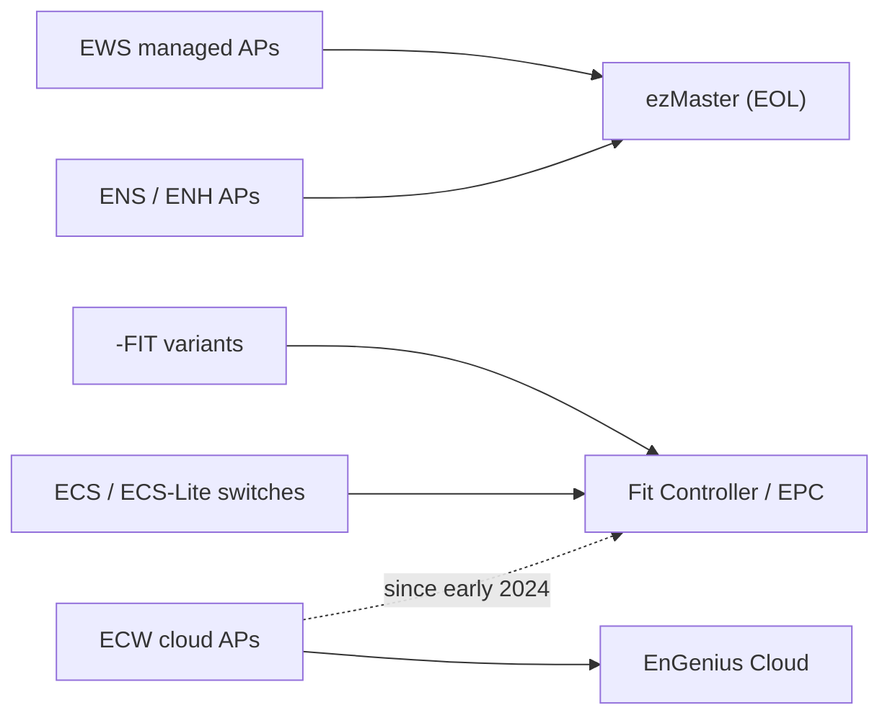

# EnGenius ecosystem overview

Map of EnGenius's WiFi product families and which controller runs them.

- Hardware is made by **Senao**; devices run a **private fork of OpenWRT**.
- The model prefix signals age and controller target.
- Two on-prem controllers: older **ezMaster** (EOL) and modern **Fit Controller /
  EnGenius Private Cloud (EPC)**. Details: [controllers/landscape](landscape.md).

## Product lines

| Prefix | Role | Controller |
|--------|------|-----------|
| **EWS** | Managed APs (CAPWAP), older line | ezMaster |
| **ENS / ENH** | Older outdoor/indoor APs | ezMaster era |
| **ECW** | Cloud AP line | Cloud; local Fit Controller since early 2024 |
| **ECS** | Cloud switches (incl. ECS-Lite) | Cloud / Fit Controller |
| **`-FIT`** | FIT variants (EWS377-FIT, EWS850-FIT) | Fit Controller (local) |

- `-FIT` is a firmware/feature variant for the local Fit Controller. Some non-FIT
  devices convert to their FIT sibling by [cross-flashing](cross-flashing.md).
- ECW was cloud-only until **early 2024**, when local Fit Controller support landed.
- "Cloud" = EnGenius's hosted management, not a controller you run.

## Which controller manages what

- **ezMaster** → older managed **EWS/ENS/ENH** (EOL).
- **Fit Controller / EPC** → **-FIT**, **ECW**, **ECS/ECS-Lite**.

Full compatibility story and workarounds: [controllers/landscape](landscape.md).

## Why hardware equivalence matters

Senao reuses the same boards across model names, so several "different" products
are identical hardware. That's what makes cross-flashing possible — an older
device can run a newer, controller-compatible sibling's firmware. Known pairs:
[hardware/model-equivalence](model-equivalence.md).
